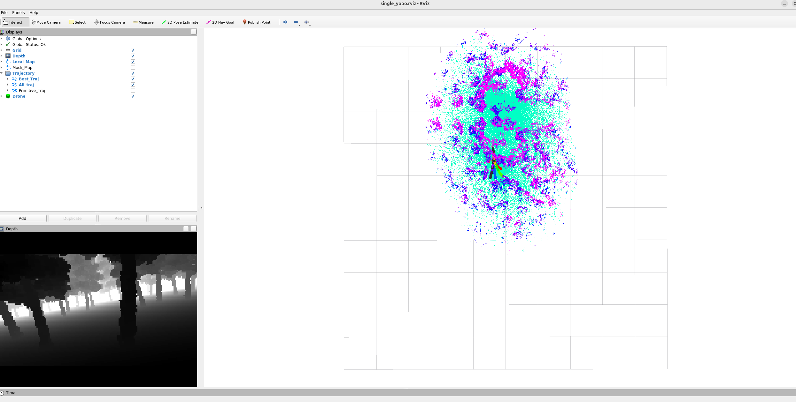
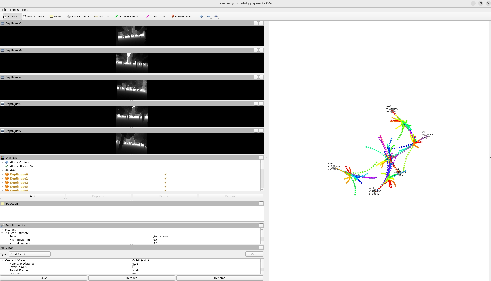

# YOPO 运行速记

## Docker 构建与启动
```bash
cd /home/dzp/projects/YOPO

docker build -f docker/simulation.dockerfile \
  -t dzp_yopo:sim-u2004-noetic-py38 \
  --network=host --progress=plain .

xhost +local:root

docker run --name dzp-yopo -itd --privileged --gpus all --network host \
  --entrypoint bash \
  -e DISPLAY -e QT_X11_NO_MITSHM=1 \
  -v $HOME/.Xauthority:/root/.Xauthority \
  -v /tmp/.X11-unix:/tmp/.X11-unix \
  --shm-size=4g \
  -v /home/dzp/projects/YOPO:/workspace/YOPO \
  dzp_yopo:sim-u2004-noetic-py38

docker exec -it dzp-yopo /bin/bash
```
实际构建的时候注意dockerfile的代理地址可以换一下，解决构建加速问题

## 单智能体

### 测试
代码有 C++ / CUDA 改动时先重编：
```bash
source /opt/ros/noetic/setup.bash

cd /workspace/YOPO/Controller
catkin_make

cd /workspace/YOPO/Simulator
catkin_make
```

停止 / 启动：
```bash
cd /workspace/YOPO

./tools/single_launch.sh --stop

./tools/single_launch.sh --trial 1 --epoch 50
```

碰撞统计：
```bash
source /opt/ros/noetic/setup.bash && rostopic echo /yopo/collision_counter_total
```



RViz：
- 配置文件：`YOPO/single_yopo.rviz`
- 在 RViz 里用 `2D Nav Goal` 设目标

### 训练
生成单机数据集：
```bash
cd /workspace/YOPO/Simulator && \
source /opt/ros/noetic/setup.bash && \
source devel/setup.bash && \
rosrun sensor_simulator dataset_generator \
  --config /workspace/YOPO/Simulator/src/config/single_config.yaml
```

训练单机权重：
```bash
cd /workspace/YOPO/YOPO && \
python3 train_yopo.py \
  --config /workspace/YOPO/YOPO/config/single_traj_opt.yaml \
  --save-root saved \
  --epochs 50 \
  --batch-size 16 \
  --num-workers 4
```

## 多智能体

### 测试
代码有 C++ / CUDA 改动时先重编：
```bash
source /opt/ros/noetic/setup.bash

cd /workspace/YOPO/Controller
catkin_make

cd /workspace/YOPO/Simulator
catkin_make
```

停止 / 启动：
```bash
cd /workspace/YOPO

./tools/swarm_launch.sh --stop

./tools/swarm_launch.sh --trial 0 --epoch 50 --uav-num 5 --radius 20 \
  --swarm-tangent-bias 0 \
  --yopo-config /workspace/YOPO/YOPO/config/swarm_traj_opt.yaml \
  --weights-root saved_swarm
```

碰撞统计：
```bash
source /opt/ros/noetic/setup.bash && rostopic echo /yopo/collision_counter_total

source /opt/ros/noetic/setup.bash && rostopic echo /yopo/uav_collision_counter_total
```



RViz：
- 配置文件：`YOPO/swarm_yopo.rviz`
- 多机模式默认不显示聚合局部点云，避免 UAV 数多时 RViz 负担太大。
- 如果需要右侧窗口显示点云，可在命令后补 `--visualize-pointcloud 1`。
- 在 RViz 里用 `2D Nav Goal` 设的不是目标而是新的圆心，各个飞机独立与圆心形成新的圆，并通过这个圆心把对面作为目标，制造冲突

### 训练
生成多机数据集：
```bash
cd /workspace/YOPO/Simulator && \
source /opt/ros/noetic/setup.bash && \
source devel/setup.bash && \
rosrun sensor_simulator dataset_generator \
  --config /workspace/YOPO/Simulator/src/config/swarm_config.yaml
```

说明：
- 多机训练流程和单机训练流程基本一致。
- 区别主要是数据集路径改为 `dataset_swarm`，并且生成的数据里会额外包含代表其它无人机的 `0.25m` 小球障碍。

训练多机权重：
```bash
cd /workspace/YOPO/YOPO && \
python3 train_yopo.py \
  --config /workspace/YOPO/YOPO/config/swarm_traj_opt.yaml \
  --save-root saved_swarm \
  --epochs 50 \
  --batch-size 16 \
  --num-workers 4
```
