# YOPO-Simple 与 YOPO-MINCO 闭环避障对比实验报告

**实验日期：** 2026-08-24

**代码基线：** `ef48ace` + 本分支实验实现

**机器可读结果：** [`docs/report_assets/`](docs/report_assets/)

## 摘要

本报告在 Perlin、Columns、Forest、Walls 四类地图上比较仓库原版 YOPO-Simple 与 YOPO-MINCO，并进一步消融 MINCO 的跨重规划连续性选择和安全走廊阈值。原模型比较包含 40 个配对 episode（80 条 rollout）；三项 MINCO 消融各含 40 个地图/种子/目标条件，每个条件交换两次 ROS/RViz 槽位，共 240 个配对记录（480 条 rollout）。原模型总体无碰撞成功率均为 50%；MINCO 的动态目标成功率为 45%（Simple 35%），但闭环指令 jerk p95 高 5.12 m/s³（95% CI 3.86–6.30）。固定同一 MINCO checkpoint 后，top-3 jerk 连续性选择使 jerk p95 降低 1.345 m/s³（95% CI 0.602–2.114），同时未改善成功率、时间或净空。验证集校准得到的走廊系数 `k=1.8` 达到 99.09% 候选准入精度，但使闭环有效规划指令比例降低 21.87 个百分点。结果表明：两段 MINCO 参数化增加了转弯表达能力；其收益受跨周期候选切换和走廊可用性制约。

## 1. 实验设计

### 1.1 研究问题与对照

| 实验 | 唯一变化 | 对照量 |
|---|---|---|
| 原模型比较 | Simple 单段参数化 vs MINCO 两段参数化、损失与走廊 | checkpoint、规划器实现同时变化 |
| `inner_topk3` | score 前 3 名中选上一周期 inner waypoint 最近者 | 同一 MINCO checkpoint，基线 `topk=1,k=1` |
| `jerk_topk3` | score 前 3 名中选新旧轨迹初始 jerk 跳变最小者 | 同上 |
| `corridor_calibrated` | 走廊下界由 `μ-b` 改为 `μ-1.8b` | 同上，`topk=1` |

连续性实验采用**在线选择消融**而非重新训练：现有训练样本相互独立，网络输入中没有上一条轨迹；在当前数据接口上加入“跨周期训练损失”会改变数据与模型结构，不能作为单变量比较。实现位置见 [`YOPO/test_yopo_ros.py#L355-L378`](YOPO/test_yopo_ros.py#L355-L378)。

### 1.2 控制变量与样本量

| 项目 | 固定设置 |
|---|---|
| 地图 | `maze_type={1,2,5,7}`；每类 `seed={1,2,3,4,5}` |
| 场景 | straight：目标 `(20,0,2)`；dynamic：2.5 s 时由 `(20,0,2)` 切至 `(10,15,2)` |
| 起点 | 两机 `(0,0,2)`；实测最大初始位置差 0.000817 m |
| 速度、时限、到达球 | 6.0 m/s、20 s、1.0 m |
| 航向律 | 两侧 `yaw_goal_weight=6.0` |
| 控制器与传感器 | 同一实现、参数和频率；两侧 simulator 独立 |
| checkpoint | 原比较各用 `epoch50.pth`；消融两侧均用 MINCO `epoch50.pth` |
| 槽位控制 | 每个消融条件各运行 normal/swapped；先在条件内平均，再统计 40 个条件 |

原比较为 `4×5×2=40` 个配对 episode。每个 MINCO 消融为 `4×5×2×2=80` 个配对记录、40 个独立条件；三项消融合计 240 个配对记录。完整性审计结果位于 [`ablation_metadata.json`](docs/report_assets/ablation_metadata.json)：240/240 地图指纹一致、无起点碰撞，normal/swapped 各 120 次。地图指纹、碰撞、净空和双侧通用记录逻辑见 [`tools/benchmark_episode.py#L263-L361`](tools/benchmark_episode.py#L263-L361)。

### 1.3 统一指标与统计

| 指标 | 计算口径 |
|---|---|
| 无碰撞成功 | 有效起点；首次进入最终目标 1 m 球；episode 内碰撞事件为 0 |
| 超时惩罚时间 | 成功取到达时间，失败取最终目标阶段完整预算 |
| 路径效率 | 最终阶段起点至目标直线距离 / 实际路径长度 |
| 最小净空 | 同一 voxel map 中到最近 occupied voxel 的距离 |
| 加速度 RMS、jerk p95 | 同一 `PositionCommand` 流重算；到达后截断；仅 READY 指令计算 |
| 有效指令比例 | 目标阶段内 `trajectory_flag==READY` 的指令比例 |
| 动态转向响应 | 速度与新目标夹角连续 0.24 s 小于 15°；未满足按剩余时限计 |

差异均为“实验项 − 对照”。原模型采用 episode 配对 bootstrap；消融先平均同一条件的 normal/swapped，再对 40 个条件做 10,000 次 cluster bootstrap。统计实现见 [`tools/analyze_comparison.py#L40-L125`](tools/analyze_comparison.py#L40-L125) 与 [`tools/analyze_ablation.py#L132-L165`](tools/analyze_ablation.py#L132-L165)。jerk 只在双方均产生足够 READY 指令的配对中计算；有效指令比例同时报告，以避免将持续制动误判为平滑。

## 2. 原模型比较：YOPO-Simple vs YOPO-MINCO

### 2.1 闭环任务结果

| 场景 | Simple 成功率 | MINCO 成功率 | 成功率差 M−S（95% CI） | 惩罚时间 S / M |
|---|---:|---:|---:|---:|
| 全部 40 对 | 50% | 50% | 0 pp `[−17.5,+17.5]` | 13.92 / 12.98 s |
| straight 20 对 | 65% | 55% | −10 pp `[−35,+15]` | 12.43 / 12.96 s |
| dynamic 20 对 | 35% | 45% | +10 pp `[−15,+35]` | 15.42 / 13.00 s |

40 对中两侧均为 0 碰撞；失败均为时限内未进入目标球。总体惩罚时间差为 −0.94 s，95% CI `[−2.79,+0.97]`。动态场景差异主要来自 Columns 和 Walls，分地图结果见图中下排。

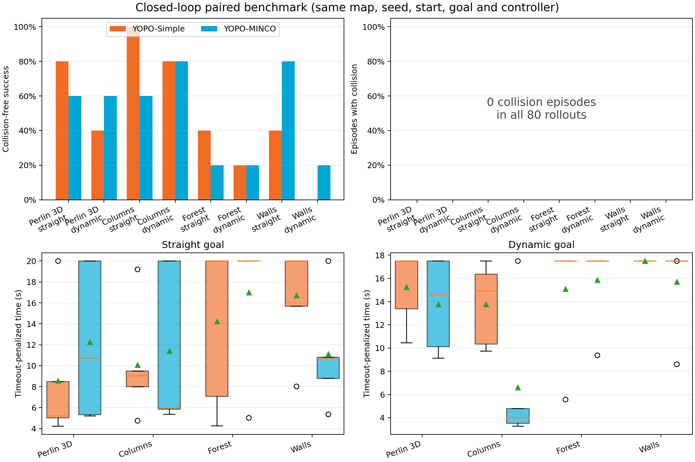

### 2.2 轨迹质量

| 指标（40 对） | Simple | MINCO | M−S（95% CI） |
|---|---:|---:|---:|
| 路径效率 ↑ | 0.501 | 0.534 | +0.033 `[−0.048,+0.112]` |
| 最小净空 ↑ | 0.755 m | 0.693 m | −0.062 m `[−0.135,+0.013]` |
| 指令加速度 RMS ↓ | 3.029 | 3.279 m/s² | +0.250 `[+0.073,+0.425]` |
| 指令 jerk p95 ↓ | 11.86 | 16.98 m/s³ | +5.12 `[+3.86,+6.30]` |
| dynamic 转向响应 ↓ | 9.24 | 6.45 s | −2.79 `[−6.85,+1.46]` |

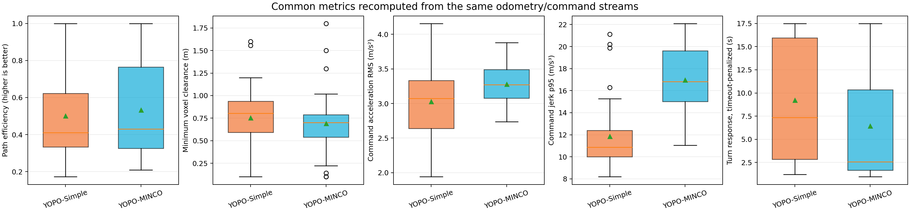

下图每个地图选择 straight 配对中“路径效率差最接近 5 个种子中位数”的样本；选择规则和文件名存于 [`benchmark_metadata.json`](docs/report_assets/benchmark_metadata.json)。

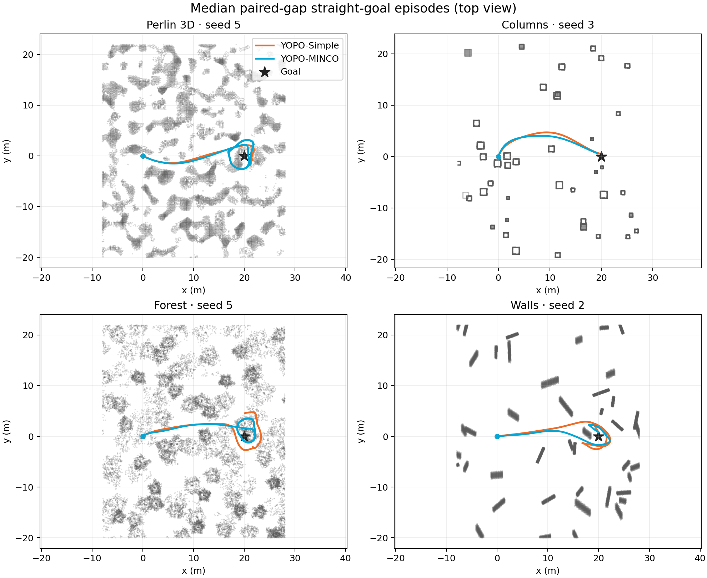

### 2.3 候选表达与动态目标

Simple 每个 anchor 输出终点 P/V/A，并生成固定时长单段五次曲线；MINCO 输出 inner position、tail P/V/A 和两段时长，并求解两段 C⁴ 连续五次曲线。相同地图和时刻的候选如下。

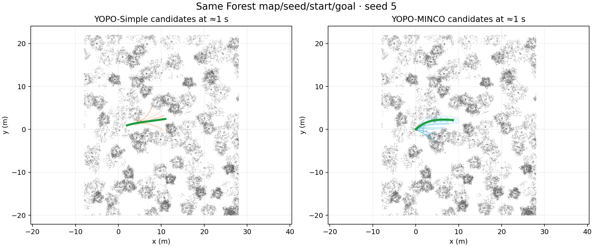


动态目标动图中的目标在 2.5 s 发生 2D 大角度切换；示例按双方成功样本中的路径效率差中位数选取，统计结论仍来自全部 20 对。

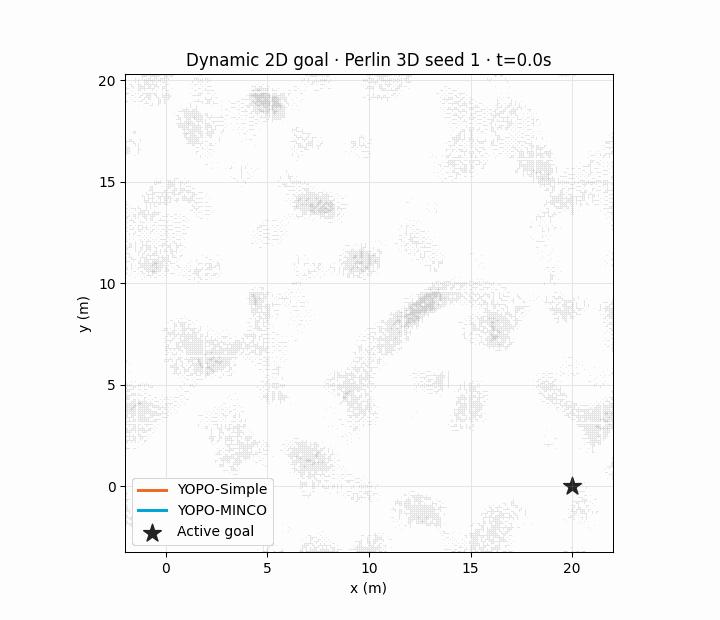

### 2.4 训练记录的公平比较

`Eval/TrajLoss` 与 `Eval/MeanTrajLoss`、`Eval/ScoreLoss` 与 `Eval/RankLoss` 的定义不同，不能横向比较绝对值。下图仅把每条曲线自身 epoch 1 归一化为 100%，用于检验模型内收敛；跨模型结论使用前述统一闭环指标。

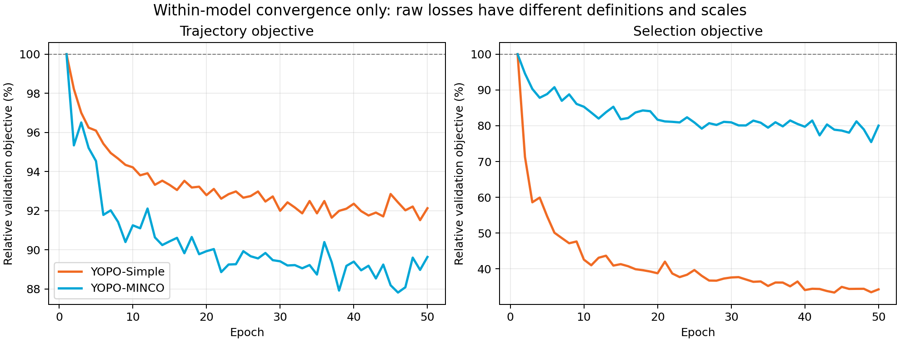

| 训练记录 | Epoch 1 | Epoch 50 | 相对变化 |
|---|---:|---:|---:|
| Simple `Eval/TrajLoss` | 3.2740 | 3.0162 | −7.87% |
| MINCO `Eval/MeanTrajLoss` | 12.6113 | 11.3040 | −10.37% |
| Simple `Eval/ScoreLoss` | 0.26230 | 0.08987 | −65.74% |
| MINCO `Eval/RankLoss` | 1.80697 | 1.44612 | −19.97% |

两份 TensorBoard event 来自已有训练，不是相同数据顺序和随机种子的重新训练；因此不用于架构显著性检验。

## 3. MINCO 在线选择与安全走廊消融

### 3.1 走廊校准

在固定验证划分上重放 checkpoint，使用训练时同一 ESDF 标签计算 `μ-kb`。扫描 `k=0…6`，选择满足候选准入精度 ≥99% 且准入数 ≥1000 的最小值。10,000 张验证图像产生 150,000 条候选和 1,500,000 个走廊点。

| 选定 `k` | 点覆盖率 | 准入候选 | 准入率 | 准入精度 | Wilson 95% 下界 | 安全候选召回 |
|---:|---:|---:|---:|---:|---:|---:|
| 1.8 | 98.19% | 58,414 | 38.94% | 99.09% | 99.01% | 52.72% |

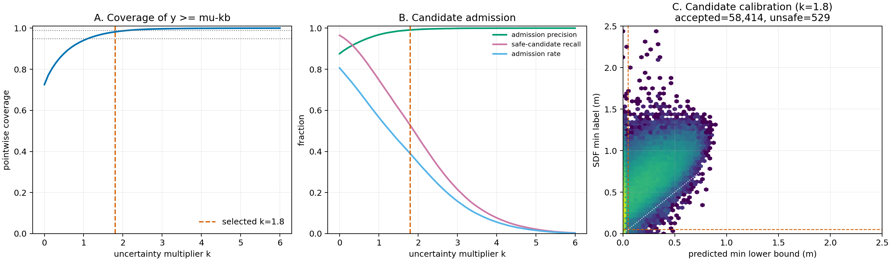

校准代码与输出分别为 [`tools/calibrate_corridor.py#L85-L125`](tools/calibrate_corridor.py#L85-L125)、[`corridor_calibration.json`](docs/report_assets/corridor_calibration.json)。该目标约束“已准入候选的点级安全”，不约束“每帧至少存在一条可用候选”。

### 3.2 闭环配对效应

表中每项为 80 个槽位配对记录，经 40 个条件聚类后的均值差和 95% CI。成功率、效率、有效指令采用百分点（pp）。

| 实验项 | 成功率 对照→实验 | Δ成功 pp | Δ惩罚时间 s | Δ效率 pp | Δ净空 cm | Δjerk p95 m/s³ | Δ有效指令 pp |
|---|---:|---:|---:|---:|---:|---:|---:|
| inner top-3 | 50.0→41.25% | −8.75 `[−21.25,+3.75]` | +1.869 `[+0.260,+3.500]` | −7.66 `[−14.06,−0.81]` | −7.57 `[−13.05,−2.15]` | −0.747 `[−1.554,+0.074]` | −0.46 `[−2.89,+2.19]` |
| jerk top-3 | 51.25→47.5% | −3.75 `[−17.50,+10.00]` | +1.227 `[−0.171,+2.668]` | −7.05 `[−12.45,−2.05]` | −7.61 `[−12.29,−3.40]` | **−1.345 `[−2.114,−0.602]`** | +0.54 `[−1.73,+3.04]` |
| calibrated `k=1.8` | 50.0→42.5% | −7.50 `[−18.75,+2.50]` | +1.009 `[−0.225,+2.406]` | +9.44 `[+1.78,+17.37]` | +1.19 `[−6.68,+9.49]` | +0.160 `[−0.347,+0.703]`* | **−21.87 `[−33.16,−11.74]`** |

\* `k=1.8` 的 jerk 仅含双方均有足够 READY 指令的 68 个槽位记录/34 个条件；持续制动样本由有效指令比例和成功率表示。inner 实验的实验侧出现 1/80 个碰撞 episode；jerk 实验的对照侧出现 1/80 个；其余均为 0，样本量不足以区分罕见碰撞率。

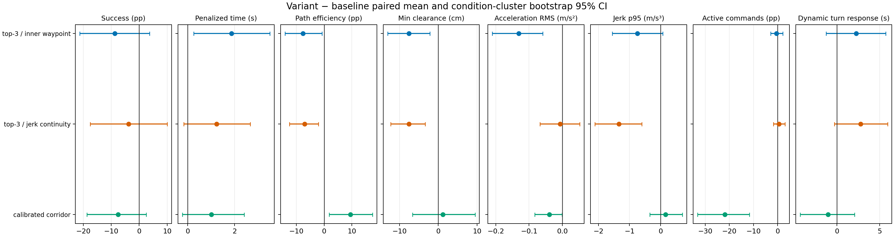

分地图热图显示 jerk 降幅跨多数 cell 存在，但成功率效应不一致；`k=1.8` 的有效指令下降集中于 Perlin、Columns straight、Forest straight 和 Walls。

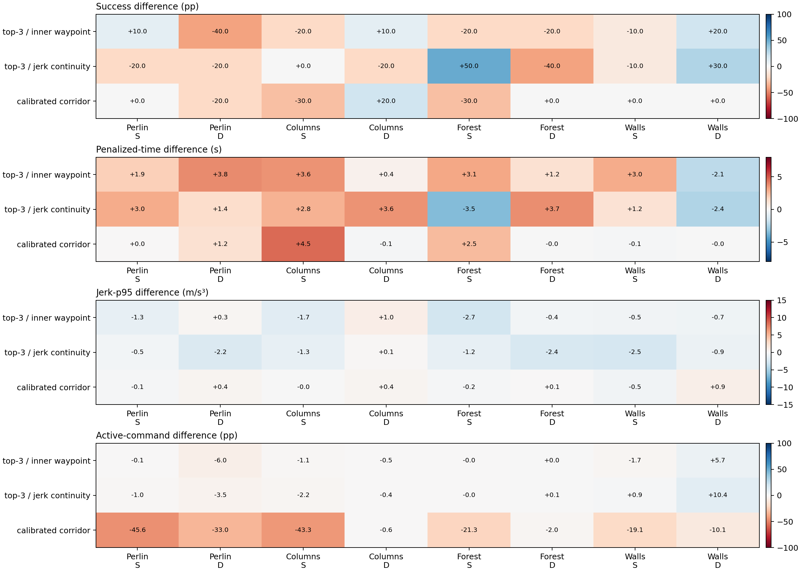

### 3.3 跨周期连续性证据

下图按预注册规则选取 dynamic jerk 实验中“对照 jerk p95 − 实验 jerk p95”最大的配对记录，仅用于展示机制；总体效应以上一节全部条件为准。候选图在目标切换后 0.8 s 读取同一时刻 RViz marker。

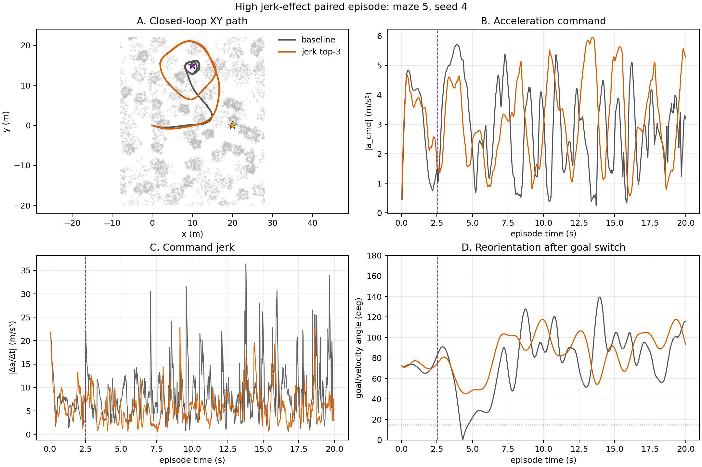

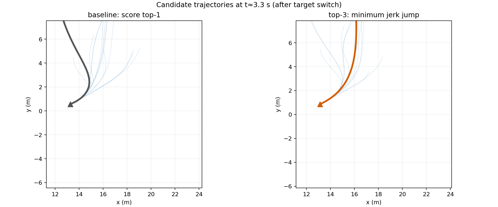

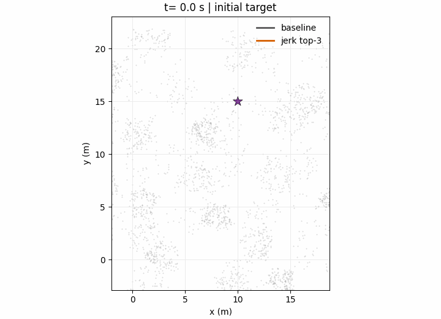

jerk top-3 直接比较上一轨迹当前 jerk 与候选初始 jerk，因此其显著结果对应实现中的被优化量；它不约束目标代价，观测到效率下降 7.05 pp。inner top-3 优化 waypoint 欧氏距离，与实际指令 jerk 不是同一量，jerk CI 跨 0。两种规则均只在 score 前 3 名中选择，代码见 [`YOPO/test_yopo_ros.py#L355-L378`](YOPO/test_yopo_ros.py#L355-L378)。

### 3.4 走廊校准的闭环失效模式

下图按“对照成功、实验失败”集合中有效指令比例最低选择。`k=1.8` 在该 Forest 起点几乎拒绝全部候选；验证集候选精度提高没有转化为在线规划可用性。

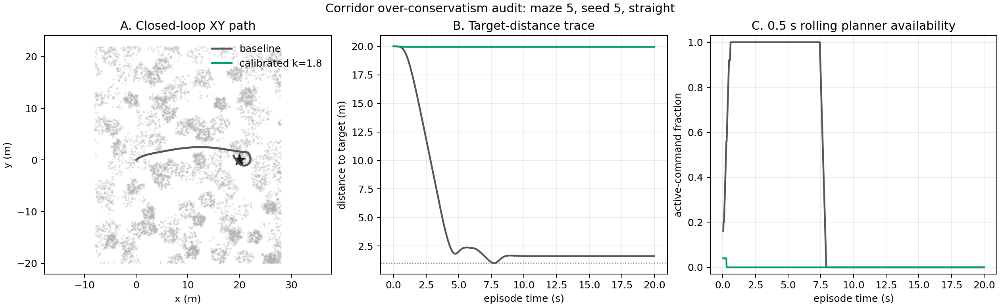

运行时先计算 `min(μ-kb)`，全部候选低于安全阈值时发布 EMPTY trajectory flag；对应代码为 [`YOPO/test_yopo_ros.py#L274-L277`](YOPO/test_yopo_ros.py#L274-L277)、[`YOPO/test_yopo_ros.py#L311-L337`](YOPO/test_yopo_ros.py#L311-L337) 和 [`YOPO/test_yopo_ros.py#L359-L363`](YOPO/test_yopo_ros.py#L359-L363)。因此后续走廊改进应联合约束 candidate-level precision 与 frame-level availability，并在独立闭环集合上选择阈值。

## 4. 代码证据与机制

| 环节 | YOPO-Simple | YOPO-MINCO | 可检验差异 |
|---|---|---|---|
| 网络 head | 9 个终态参数 + 1 cost：[`yopo_network.py#L37-L40`](YOPO/simple_runtime/policy/yopo_network.py#L37-L40) | 14 个轨迹参数 + 1 score + 20 个走廊参数：[`yopo_network.py#L53-L68`](YOPO/policy/yopo_network.py#L53-L68) | 输出通道 10 vs 35 |
| 轨迹 | 一段五次多项式，P/V/A 边界：[`poly_solver.py#L4-L37`](YOPO/simple_runtime/policy/poly_solver.py#L4-L37) | 两段五次、可变时长、inner 处 C⁴：[`poly_solver.py#L25-L84`](YOPO/policy/poly_solver.py#L25-L84) | 单候选可包含一次内点转折 |
| 轨迹代价 | smooth+safety+goal+acc：[`yopo_trainer.py#L145-L175`](YOPO/simple_runtime/policy/yopo_trainer.py#L145-L175) | smooth+acc+safety+goal+feasible+time：[`loss_function.py#L54-L69`](YOPO/loss/loss_function.py#L54-L69) | MINCO 显式约束可行性和时长 |
| 选择训练 | Smooth-L1 回归绝对 cost：[`yopo_trainer.py#L171-L175`](YOPO/simple_runtime/policy/yopo_trainer.py#L171-L175) | 最低代价可行候选的交叉熵排序：[`yopo_trainer.py#L213-L236`](YOPO/policy/yopo_trainer.py#L213-L236) | 回归 vs 排序 |
| 走廊训练 | 无 | 非对称 Laplace NLL：[`yopo_trainer.py#L238-L246`](YOPO/policy/yopo_trainer.py#L238-L246) | 预测 `μ,b`，过估净空加权 |
| 时序选择 | cost top-1 | score top-1 / inner top-3 / jerk top-3：[`test_yopo_ros.py#L355-L378`](YOPO/test_yopo_ros.py#L355-L378) | 单候选 C⁴ 不等于跨周期连续 |

参数量和相同 GPU 网络前向 microbenchmark：

| 模型 | 参数量 | head 通道 | mean / median / p95 |
|---|---:|---:|---:|
| Simple | 11,304,287 | 10 | 0.542 / 0.524 / 0.728 ms |
| MINCO | 11,310,712 | 35 | 0.550 / 0.535 / 0.704 ms |

MINCO 只增加 6,425 个参数（0.0568%）；本次差异不能归因于更大的 backbone。数据见 [`inference_benchmark.json`](docs/report_assets/inference_benchmark.json)。该测量不含 ROS、渲染、后处理与多项式求解。

## 5. 复现

以下命令均在保留容器 `dzp-yopo-minco-test` 中运行。原始 episode JSON 位于被 Git 忽略的 `results/`；脚本、聚合 CSV/JSON、PNG/GIF 纳入版本控制。

### 5.1 构建与单元测试

```bash
docker exec dzp-yopo-minco-test bash -lc '
  source /opt/ros/noetic/setup.bash
  cd /workspace/YOPO/Simulator
  catkin_make -DCMAKE_BUILD_TYPE=Release'

docker exec dzp-yopo-minco-test bash -lc '
  source /opt/ros/noetic/setup.bash
  cd /workspace/YOPO
  python3 tools/test_minco_selection.py'
```

### 5.2 原模型 40 对闭环实验

```bash
docker exec dzp-yopo-minco-test bash -lc '
  cd /workspace/YOPO
  tools/run_comparison_benchmark.sh \
    --maze-types 1,2,5,7 --seeds 1,2,3,4,5 \
    --scenarios straight,dynamic \
    --velocity 6.0 --arrival-radius 1.0 \
    --yaw-goal-weight 6.0 --timeout 20'

docker exec dzp-yopo-minco-test bash -lc '
  cd /workspace/YOPO
  python3 tools/analyze_comparison.py
  python3 tools/benchmark_inference.py'
```

批处理入口：[`tools/run_comparison_benchmark.sh`](tools/run_comparison_benchmark.sh)；逐 episode 记录：[`tools/benchmark_episode.py`](tools/benchmark_episode.py)。目标 JSON 已存在时自动跳过，可断点续跑。

### 5.3 走廊校准

```bash
docker exec dzp-yopo-minco-test bash -lc '
  cd /workspace/YOPO
  python3 tools/calibrate_corridor.py \
    --checkpoint YOPO/saved/yopo-minco/epoch50.pth \
    --dataset-path ../dataset_minco \
    --seed 0 --target-precision 0.99 \
    --sigma-max 6 --sigma-step 0.1 --min-admissions 1000'
```

### 5.4 三项 MINCO 消融与制图

```bash
docker exec dzp-yopo-minco-test bash -lc '
  cd /workspace/YOPO
  tools/run_minco_ablation.sh \
    --experiments inner_topk3,jerk_topk3,corridor_calibrated \
    --maze-types 1,2,5,7 --seeds 1,2,3,4,5 \
    --scenarios straight,dynamic --lane-orders normal,swapped \
    --velocity 6.0 --arrival-radius 1.0 \
    --yaw-goal-weight 6.0 --timeout 20
  python3 tools/analyze_ablation.py'
```

消融矩阵定义在 [`tools/run_minco_ablation.sh#L82-L133`](tools/run_minco_ablation.sh#L82-L133)。输出包括逐 rollout [`ablation_episodes.csv`](docs/report_assets/ablation_episodes.csv)、聚合 [`ablation_aggregate.csv`](docs/report_assets/ablation_aggregate.csv)、配对置信区间 [`ablation_paired.json`](docs/report_assets/ablation_paired.json) 和完整性元数据 [`ablation_metadata.json`](docs/report_assets/ablation_metadata.json)。

checkpoint SHA-256：

```text
YOPO-Simple  09ec31094ed83e09702efc1facf18076564ebbe1afc164960c41036e16ba229f
YOPO-MINCO   2d85e712c8874d11cd4e523777698eff78914fdb8f1ffb5068b037f8f972f62f
```

## 6. 结论与边界

1. 在当前 40 对原模型闭环样本中，总体成功率无差异；MINCO 的动态目标结果较好，但置信区间仍覆盖 0。
2. MINCO 单候选 C⁴ 连续未自动降低跨周期指令 jerk。固定 checkpoint 的 jerk top-3 消融验证了直接优化新旧 jerk 跳变可降低闭环 jerk，但本实现以路径效率和净空为代价。
3. `k=1.8` 在固定验证集满足 99% 候选准入精度，闭环中却显著降低规划可用性；安全走廊阈值必须同时校准精度、召回和 frame-level availability。
4. 结果限定于 0.1 m voxel 静态地图、质点碰撞模型、5 个地图种子和现有 checkpoint。动态场景指目标突变，不包含动态障碍；训练 event 不是同随机种子的架构重训。
