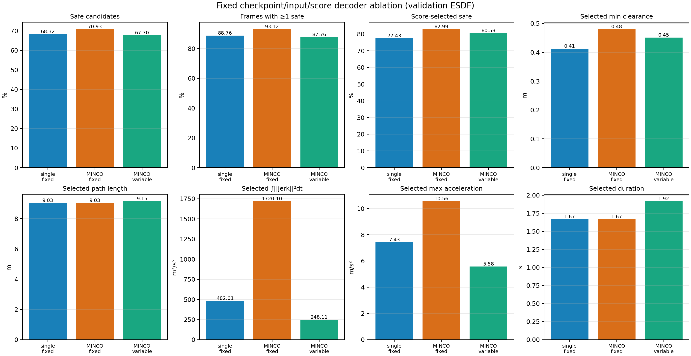
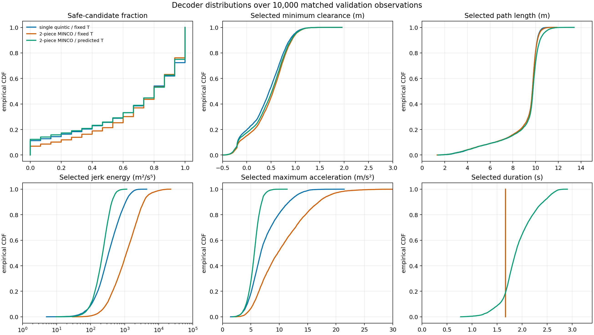
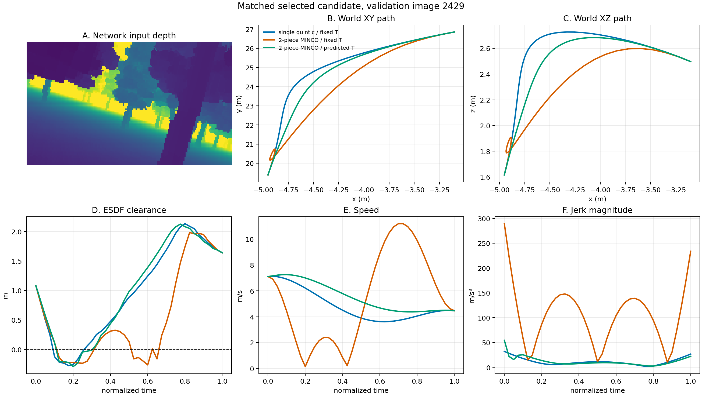
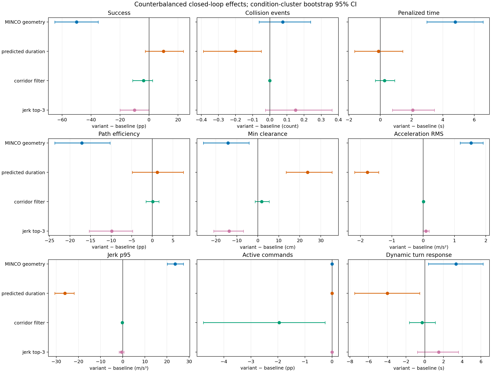
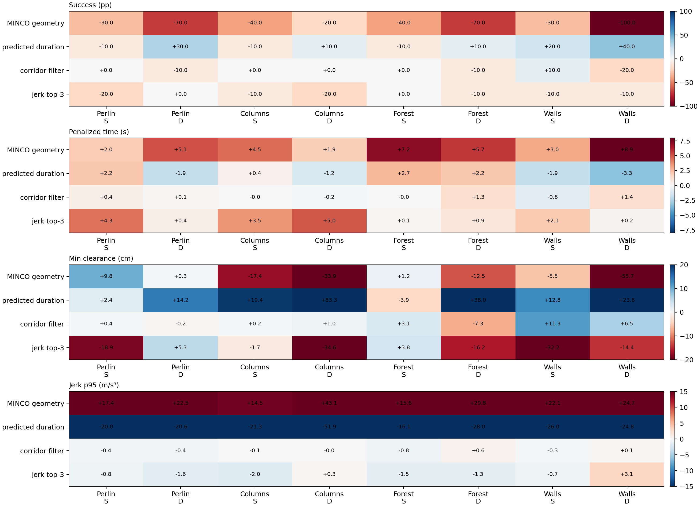
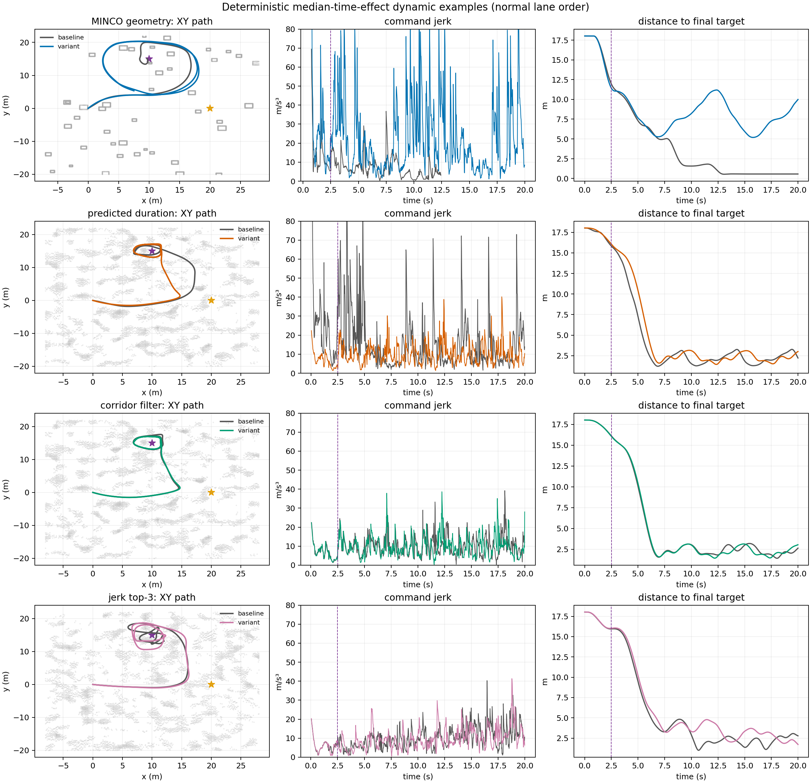
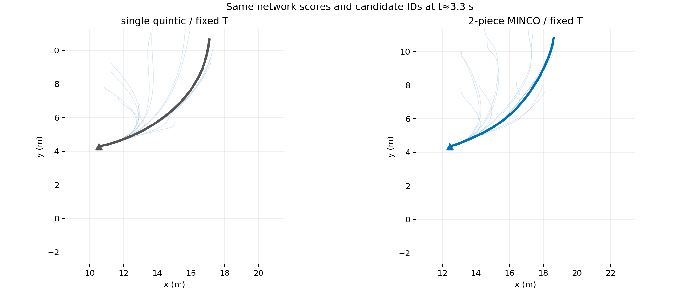
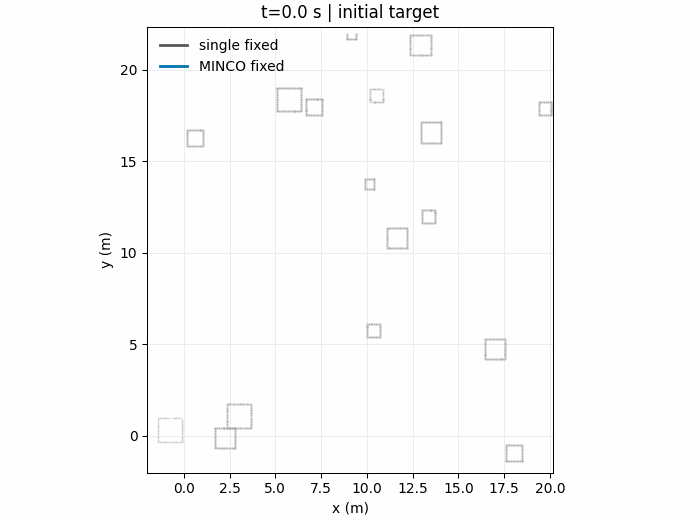

# YOPO 中 MINCO 轨迹表示的控制变量消融报告

**实验日期：** 2026-08-24

**实验分支：** `yopo-minco-test`
**固定 checkpoint：** `YOPO/saved/yopo-minco/epoch50.pth`（SHA-256 见 [`decoder_validation.json`](docs/report_assets/decoder_validation.json)）

## 摘要

代码审计确认：原 YOPO-Simple 与当前 YOPO-MINCO 的差异不止单段五次多项式和两段 MINCO。二者还同时改变了候选参数化、score 训练、碰撞代价、可行性与时长损失、目标采样以及 learned safe corridor。因此，旧版完整系统对比可以评价两个部署包，不能把结果归因于 MINCO。

本报告改用同一 MINCO checkpoint、同一次网络前向、同一 head/tail P/V/A、同一候选 ID 和 score，只切换轨迹解码器。10,000 个验证观测、每种模式 150,000 条候选的结果表明：加入 inner waypoint 并固定总时长后，score 所选候选的无碰撞证书通过率提高 5.56 pp、最小 ESDF 净空提高 6.81 cm，但 jerk 能量增加 1,238 m²/s⁵；进一步启用预测时长后，jerk 能量减少 1,472 m²/s⁵、峰值加速度减少 4.98 m/s²，同时所选候选证书通过率下降 2.41 pp。几何自由度与时长自由度的作用方向不同，不能合并为“MINCO 更平滑”。

闭环部分采用四个独立估计量：MINCO 几何、预测时长、在线 corridor filter、跨周期 jerk top-3。320 条反平衡记录表明：固定短时长下加入两段 MINCO 几何使成功率下降 50.0 pp、jerk p95 增加 23.71 m/s³；在相同两段几何上启用预测时长使 jerk p95 降低 26.08 m/s³、净空增加 23.75 cm，并减少 0.20 次碰撞事件。corridor filter 未产生可分辨的安全收益，jerk top-3 也未显著降低 jerk，且使惩罚时间增加 2.07 s。固定 checkpoint 消除了网络、head、score、训练损失和 corridor 辅助训练在组间的变化；这些结论仅表示该 checkpoint 下的运行时干预效应，不等价于从头训练的架构效应。

## 1. 因果审计

### 1.1 safe corridor 是否与 MINCO 解耦

结论分为两层：

| 层次 | 代码证据 | 与轨迹表示的关系 | 本报告处理 |
|---|---|---|---|
| 在线准入与制动 | `μ-kb` 只在候选选择前计算：[`test_yopo_ros.py#L221-L225`](YOPO/test_yopo_ros.py#L221-L225)；无候选时发布 `EMPTY`：[`test_yopo_ros.py#L345-L354`](YOPO/test_yopo_ros.py#L345-L354) | 可在不改变多项式求解器的情况下关闭 | 独立比较 `filter − off` |
| corridor 预测 head | 20 个 `μ,b` 通道与轨迹/score 共享 backbone：[`yopo_network.py#L26-L35`](YOPO/policy/yopo_network.py#L26-L35) | 结构上是辅助 head，不是 MINCO 约束 | 三个解码模式共用同一 head/checkpoint |
| corridor 训练 | radius NLL 加入总 loss：[`yopo_trainer.py#L177-L181`](YOPO/policy/yopo_trainer.py#L177-L181)、[`yopo_trainer.py#L238-L246`](YOPO/policy/yopo_trainer.py#L238-L246) | 梯度经共享 backbone 与轨迹学习耦合 | corridor-off 只识别在线过滤效应；不声称识别辅助训练效应 |

因此，对“原版 Simple”与“MINCO + corridor”直接比较并归因为 MINCO 不公平。该担心成立；但“corridor 完全独立于训练”也不成立，因为辅助 loss 影响共享特征。

### 1.2 原完整系统比较中的其他混杂因素

| 因素 | YOPO-Simple | YOPO-MINCO | 是否属于纯轨迹表示 |
|---|---|---|---|
| 输出 | 9 个终点 P/V/A + 1 cost：[`simple yopo_network.py#L14-L40`](YOPO/simple_runtime/policy/yopo_network.py#L14-L40) | inner 3 + tail P/V/A 9 + durations 2 + score 1 + corridor 20：[`yopo_network.py#L26-L68`](YOPO/policy/yopo_network.py#L26-L68) | 部分；corridor 与 score 非表示本体 |
| 终点坐标参数化 | anchor-relative position/velocity/acceleration：[`simple state_transform.py#L20-L58`](YOPO/simple_runtime/policy/state_transform.py#L20-L58) | grid-anchored inner、FOV 内自由 tail：[`state_transform.py#L40-L101`](YOPO/policy/state_transform.py#L40-L101) | 候选生成机制；会混入多项式比较 |
| score 监督 | 绝对 cost 的 Smooth-L1：[`simple yopo_trainer.py#L171-L175`](YOPO/simple_runtime/policy/yopo_trainer.py#L171-L175) | feasible top-1 交叉熵排序：[`yopo_trainer.py#L213-L236`](YOPO/policy/yopo_trainer.py#L213-L236) | 否 |
| 在线方向 | `argmin(cost)`：[`simple test_yopo_ros.py#L250-L263`](YOPO/simple_runtime/test_yopo_ros.py#L250-L263) | `argmax(score)`，可先 corridor 准入：[`test_yopo_ros.py#L382-L405`](YOPO/test_yopo_ros.py#L382-L405) | 否 |
| 安全代价 | 30 点指数 SDF 均值：[`simple safety_loss.py#L38-L74`](YOPO/simple_runtime/loss/safety_loss.py#L38-L74) | free-ball 连续碰撞证书与混合聚合：[`safety_loss.py#L41-L88`](YOPO/loss/safety_loss.py#L41-L88) | 否 |
| guidance | 投影/横向距离，`perp_weight=0.5`：[`simple guidance_loss.py#L52-L78`](YOPO/simple_runtime/loss/guidance_loss.py#L52-L78) | endpoint Smooth-L1，`perp_weight=0.3`：[`guidance_loss.py#L6-L27`](YOPO/loss/guidance_loss.py#L6-L27) | 否 |
| 可行性与时间 | 无独立项 | speed/acc/jerk、曲率、转向与近目标停止：[`feasible_loss.py#L7-L78`](YOPO/loss/feasible_loss.py#L7-L78)；time cost：[`loss_function.py#L54-L67`](YOPO/loss/loss_function.py#L54-L67) | 否；但会影响表示的训练结果 |
| loss 权重 | `wg=.15, ws=10, wa=1, wc=1`：[`simple traj_opt.yaml#L9-L13`](YOPO/simple_runtime/config/traj_opt.yaml#L9-L13) | `wg=.6, ws=.002, wa=.002, wt=wf=1.5`：[`traj_opt.yaml#L11-L23`](YOPO/config/traj_opt.yaml#L11-L23) | 否 |
| goal 采样 | yaw/pitch、10% 近目标：[`simple yopo_dataset.py#L126-L136`](YOPO/simple_runtime/policy/yopo_dataset.py#L126-L136) | 另将目标世界高度限制到 0.5–2.5 m：[`yopo_dataset.py#L124-L144`](YOPO/policy/yopo_dataset.py#L124-L144) | 否 |
| 跨周期 top-k | 无 | `inner` 或 `jerk` 连续性重排：[`test_yopo_ros.py#L389-L405`](YOPO/test_yopo_ros.py#L389-L405) | 否，属于在线时序选择 |

原 TensorBoard 的 `Eval/TrajLoss`、`Eval/MeanTrajLoss`、`ScoreLoss` 和 `RankLoss` 由不同项与不同权重构成，归一化曲线仍不能形成跨模型的公平指标。因此旧训练曲线和旧完整系统闭环结果均不进入本报告的 MINCO 效应表。

## 2. 新实验设计

### 2.1 估计量与唯一变化

| 实验 | baseline | variant | 固定项 | 识别的效应 |
|---|---|---|---|---|
| `geometry` | `single_fixed` | `minco_fixed` | MINCO checkpoint/head/tail/score；`T=1.667 s`；corridor off；top-1 | 使用 inner 与两段 C⁴ 几何的运行时效应 |
| `duration` | `minco_fixed` | `minco_variable` | 两段 MINCO、inner/tail/score；corridor off；top-1 | 使用预测分段时长的运行时效应 |
| `corridor` | `corridor_off` | `corridor_filter` | `minco_variable`；score top-1；`safe_radius=.05 m,k=1` | learned corridor 在线准入/制动效应 |
| `temporal` | `score_top1` | `jerk_top3` | `minco_variable`；corridor off；同一 score | 跨重规划 jerk 重排效应 |

运行时开关定义于 [`test_yopo_ros.py#L53-L60`](YOPO/test_yopo_ros.py#L53-L60)；固定时长和求解器的唯一分支位于 [`test_yopo_ros.py#L286-L298`](YOPO/test_yopo_ros.py#L286-L298)。非 `minco_variable` 模式禁止使用 learned corridor，防止把沿原 MINCO 曲线训练的 radius 标签套到另一条曲线上。

`single_fixed` 使用与原版相同的 P/V/A 边界五次曲线形式。原实现的闭式解见 [`simple poly_solver.py#L4-L37`](YOPO/simple_runtime/policy/poly_solver.py#L4-L37)；批量等价求解见 [`poly_solver.py#L20-L96`](YOPO/policy/poly_solver.py#L20-L96)。[`test_trajectory_modes.py`](tools/test_trajectory_modes.py) 在随机边界和 31 个采样时刻逐轴验证两者 position/velocity/acceleration 数值一致。

### 2.2 固定输入候选实验

每张验证图只执行一次 MINCO 网络前向。三个解码器共享 15 个 candidate 的 head/tail、score 和 `argmax(score)` ID；使用 41 个归一化时刻、同一 ESDF 与同一 free-ball chain 证书。实现见 [`evaluate_decoder_ablation.py#L1-L8`](tools/evaluate_decoder_ablation.py#L1-L8)、[`evaluate_decoder_ablation.py#L69-L123`](tools/evaluate_decoder_ablation.py#L69-L123)。

样本量为 10,000 个验证观测、每种模式 150,000 条候选。配对差先在每个观测内计算，再对观测做 10,000 次 bootstrap；15 条候选不作为独立样本。

### 2.3 闭环实验

每项包含 `4 maze_type × 5 seed × 2 scenario × 2 lane order = 80` 个配对记录，对应 40 个独立地图/目标条件。normal/swapped 是同一条件的重复测量，先在条件内平均，再对 40 个条件做 cluster bootstrap。批处理矩阵和槽位交换见 [`run_controlled_ablation.sh#L91-L147`](tools/run_controlled_ablation.sh#L91-L147)。

| 控制量 | 设置 |
|---|---|
| 地图 | `maze_type={1,2,5,7}`；`seed={1,2,3,4,5}` |
| 目标 | straight `(20,0,2)`；dynamic 在 2.5 s 由 `(20,0,2)` 切换到 `(10,15,2)` |
| 起点/速度/时限 | `(0,0,2)`；6.0 m/s；20 s；到达球 1.0 m |
| 共同系统 | 相同 checkpoint、backbone/head、深度处理、score、控制器、yaw law 和 simulator 参数 |
| 通用指标 | 无碰撞成功、碰撞事件、超时惩罚时间、路径效率、最小净空、acc RMS、jerk p95、READY 指令比例、动态转向响应 |

闭环差异定义为 `variant − baseline`。动态转向响应只在 dynamic 条件计算；jerk 只使用双方有效的 READY 指令，另行报告 READY 比例，避免把持续制动解释为低 jerk。

## 3. 固定输入候选结果

### 3.1 总体量与分布





| 解码器 | 无碰撞候选 | 至少一条无碰撞候选 | score 所选无碰撞 | 所选最小净空 | 所选 jerk 能量 | 所选峰值加速度 | 时长 |
|---|---:|---:|---:|---:|---:|---:|---:|
| single fixed | 68.32% | 88.76% | 77.43% | 0.412 m | 482.0 m²/s⁵ | 7.43 m/s² | 1.667 s |
| MINCO fixed | 70.93% | 93.12% | 82.99% | 0.481 m | 1720.1 m²/s⁵ | 10.56 m/s² | 1.667 s |
| MINCO variable | 67.70% | 87.76% | 80.58% | 0.451 m | 248.1 m²/s⁵ | 5.58 m/s² | 1.919 s |

### 3.2 配对效应

| 效应（variant − baseline） | Δ无碰撞候选 | Δ所选无碰撞 | Δ所选净空 | Δ路径长度 | Δjerk 能量 | Δ峰值加速度 | Δ时长 |
|---|---:|---:|---:|---:|---:|---:|---:|
| MINCO fixed − single fixed | +2.607 pp `[+2.344,+2.867]` | +5.56 pp `[+5.05,+6.08]` | +6.81 cm `[+6.58,+7.04]` | +0.004 m `[+0.002,+0.007]` | +1238 `[+1201,+1274]` | +3.129 m/s² `[+3.063,+3.195]` | 0 |
| MINCO variable − MINCO fixed | −3.235 pp `[−3.490,−2.982]` | −2.41 pp `[−2.84,−1.97]` | −2.93 cm `[−3.14,−2.72]` | +0.117 m `[+0.112,+0.122]` | −1472 `[−1509,−1435]` | −4.983 m/s² `[−5.067,−4.900]` | +0.252 s `[+0.245,+0.258]` |

inner waypoint 提高了当前候选集的绕障自由度，但在固定短时长下，为满足 head/inner/tail 和 C⁴ 连续约束会产生更高导数。预测时长提供了时间缩放自由度，降低导数代价，但其平均更长的轨迹时间同时改变了空间曲线和证书通过率。两项必须分别解释。

下图按 `max_t ||p_minco_fixed(t)-p_single_fixed(t)||` 选择差异最大的 score 所选候选，仅展示机制，不用于总体估计。三条曲线具有完全相同的网络输入、candidate ID、head/tail P/V/A；橙色固定时长 MINCO 在 inner 约束附近出现速度反转和高 jerk，绿色可变时长曲线消除了大部分导数峰值。



## 4. 闭环反平衡结果

### 4.1 完整性检查与总体效应

共得到 320 条配对记录，每项 80 条、40 个独立条件 cluster；每个条件同时包含 normal/swapped 槽位。地图点云逐对一致，0 个无效起点，双机初始位置最大差为 0.82 mm。分析器的完整性断言见 [`analyze_controlled_ablation.py#L275-L280`](tools/analyze_controlled_ablation.py#L275-L280)，机器可读审计结果见 [`controlled_metadata.json`](docs/report_assets/controlled_metadata.json)。

下表均为 `variant − baseline` 的条件聚类均值及 10,000 次 bootstrap 95% CI；pp 表示百分点。成功率、碰撞事件和净空是安全/任务指标，惩罚时间将未到达统一记为 20 s。

| 干预 | Δ成功率 (pp) | Δ碰撞事件 | Δ惩罚时间 (s) | Δ路径效率 (pp) | Δ最小净空 (cm) |
|---|---:|---:|---:|---:|---:|
| MINCO geometry | −50.00 `[−65.00,−35.00]` | +0.075 `[−0.062,+0.237]` | +4.789 `[+2.974,+6.573]` | −17.110 `[−23.687,−10.266]` | −14.214 `[−25.910,−4.116]` |
| predicted duration | +10.00 `[−2.50,+23.75]` | −0.200 `[−0.388,−0.050]` | −0.109 `[−1.636,+1.434]` | +1.202 `[−4.870,+7.561]` | +23.747 `[+13.551,+35.370]` |
| corridor filter | −3.75 `[−11.25,+2.50]` | 0 `[0,0]` | +0.274 `[−0.314,+0.925]` | +0.145 `[−1.543,+1.643]` | +1.863 `[−1.265,+5.436]` |
| jerk top-3 | −10.00 `[−20.00,0.00]` | +0.150 `[−0.025,+0.362]` | +2.073 `[+0.776,+3.454]` | −9.835 `[−15.339,−4.754]` | −13.612 `[−20.995,−6.813]` |

| 干预 | Δacc RMS (m/s²) | Δjerk p95 (m/s³) | ΔREADY 指令 (pp) | Δ动态转向响应 (s) |
|---|---:|---:|---:|---:|
| MINCO geometry | +1.529 `[+1.181,+1.917]` | +23.708 `[+20.127,+27.428]` | 0 `[0,0]` | +3.345 `[+0.396,+6.244]` |
| predicted duration | −1.777 `[−2.187,−1.417]` | −26.082 `[−30.685,−21.908]` | 0 `[0,0]` | −3.987 `[−7.495,−0.528]` |
| corridor filter | +0.009 `[−0.018,+0.037]` | −0.151 `[−0.475,+0.172]` | −1.954 `[−4.758,−0.253]` | −0.283 `[−1.634,+1.127]` |
| jerk top-3 | +0.089 `[−0.008,+0.192]` | −0.549 `[−1.585,+0.605]` | 0 `[0,0]` | +1.492 `[−0.775,+3.610]` |



绝对量提供效应的基准尺度：geometry 的成功率由 93.75% 降至 43.75%，jerk p95 由 18.16 增至 41.86 m/s³；duration 的成功率由 45.00% 升至 55.00%，jerk p95 由 42.76 降至 16.68 m/s³。corridor 的成功率为 53.75%→50.00%，READY 比例为 100%→98.05%；temporal 的成功率为 55.00%→45.00%，jerk p95 仅为 16.72→16.17 m/s³。完整绝对量见 [`controlled_aggregate.csv`](docs/report_assets/controlled_aggregate.csv)，配对量见 [`controlled_paired.json`](docs/report_assets/controlled_paired.json)。

### 4.2 地图异质性与动态目标



每个热图单元仅含 5 个 seed、每个 seed 两种槽位顺序，因此用于检查效应方向的异质性，不单独作显著性判断。geometry 的 jerk 增幅及 duration 的 jerk 降幅在 8 个地图/目标分层中方向一致；安全结果的幅度具有明显地图差异。corridor 的总体 CI 跨零，与逐地图正负混合一致。

下图按确定性的“动态条件下惩罚时间效应最接近中位数”规则选择 normal 槽位样例，而非挑选最有利 episode。紫色虚线为 2.5 s 目标切换；星号为新目标。geometry 样例显示固定短时长 MINCO 的连续高 jerk 与未收敛，duration 样例显示预测时长主要改变动力学量级。样例选择和绘图实现见 [`analyze_controlled_ablation.py#L184-L252`](tools/analyze_controlled_ablation.py#L184-L252)。



geometry 的同一时刻候选图进一步固定了网络 score 与 candidate ID：左右唯一变化为是否使用 inner waypoint/两段 MINCO。动态目标完整过程见 GIF。





### 4.3 因果解释

1. `geometry` 不是“MINCO 一定更差”的架构结论。它表明对一个按可变时长 MINCO 训练的 checkpoint，在相同 score/head/tail 下强制短时长并加入 inner/两段约束，会显著放大导数并恶化闭环反馈；这与固定输入实验中 MINCO fixed 的高 jerk 一致。离线证书通过率提高而闭环成功率下降并不矛盾：前者只检查单次候选的空间 free-ball 证书，后者还受高导数、滚动重规划和控制跟踪影响。
2. `duration` 是本实验中可明确归因的主要平滑度来源：两组均使用相同两段 MINCO 几何，预测时长显著降低 acc/jerk、提高净空并减少碰撞事件。成功率的总体 CI 跨零，不能据此声称总体成功率已确定提高；dynamic 子集的转向响应则缩短。
3. `corridor` 未显示可分辨的成功率、净空或 jerk 改善，却减少 1.95 pp READY 指令。这只是否定当前阈值下在线 filter 的收益，不否定 radius 辅助训练对 backbone 的潜在作用。
4. `temporal` 没有显著降低 jerk p95，且增加惩罚时间、降低效率和净空。旧报告若以“corridor-on top-1”对“corridor-off top-3”，会把两个工程机制混在同一差值中；本次 corridor-off 的同 score 对比不支持将平滑度收益归因于 top-3。

## 5. 解释边界

1. 本报告识别的是**固定 MINCO checkpoint 下启用某个运行时自由度的效应**。score、inner 和 duration 均由面向完整 MINCO 训练的网络产生；因此结果不能外推为“若从头公平训练 single 与 MINCO，差异仍为该数值”。
2. 固定 checkpoint 使 radius 辅助训练、rank loss、安全损失等成为各解码组共同背景，消除了它们在组间的变化；但无法估计移除 radius loss 后 backbone 会如何变化。该问题需要 matched retraining。
3. 原 YOPO-Simple 与完整 YOPO-MINCO 仍可作为 deployment-package 对比，但其估计量是所有代码变化的联合效应。本报告不再使用该结果解释 MINCO 表示。
4. 完整训练期架构实验至少需要：相同宽度 head；相同预生成 state/goal manifest；相同安全、guidance、feasible、time 和 score 目标；corridor 全部关闭或全部保留；相同训练 seed 集、epoch 与 checkpoint 规则。单段、多段固定时长和多段可变时长应分别训练。当前仓库没有满足这些条件的三组 checkpoint，故不报告训练曲线显著性。

## 6. 复现

所有命令在保留容器 `dzp-yopo-minco-test` 中执行。大体积逐图/逐 episode 原始数据位于 Git 忽略的 `results/`；分析脚本、CSV/JSON 汇总及 PNG/GIF 位于 Git 管理的 `docs/report_assets/`。

### 6.1 数值与选择测试

```bash
docker exec dzp-yopo-minco-test bash -lc '
  source /opt/ros/noetic/setup.bash
  cd /workspace/YOPO
  python3 tools/test_trajectory_modes.py
  python3 tools/test_minco_selection.py
  python3 tools/test_controlled_analysis.py
  python3 -m py_compile \
    YOPO/policy/poly_solver.py YOPO/test_yopo_ros.py \
    tools/evaluate_decoder_ablation.py tools/analyze_controlled_ablation.py
  bash -n tools/launch_compare.sh tools/run_controlled_ablation.sh'
```

### 6.2 10,000 张验证图固定输入消融

```bash
docker exec dzp-yopo-minco-test bash -lc '
  cd /workspace/YOPO
  python3 tools/evaluate_decoder_ablation.py \
    --checkpoint YOPO/saved/yopo-minco/epoch50.pth \
    --dataset-path ../dataset_minco \
    --batch-size 16 --samples 41 --seed 0'
```

逐图原始数据为 `results/decoder_validation_raw.csv`；Git 中保存 [`decoder_validation.json`](docs/report_assets/decoder_validation.json) 及三张图。

### 6.3 四项闭环消融

```bash
docker exec dzp-yopo-minco-test bash -lc '
  source /opt/ros/noetic/setup.bash
  cd /workspace/YOPO
  tools/run_controlled_ablation.sh \
    --experiments geometry,duration,corridor,temporal \
    --maze-types 1,2,5,7 --seeds 1,2,3,4,5 \
    --scenarios straight,dynamic --lane-orders normal,swapped \
    --velocity 6.0 --arrival-radius 1.0 \
    --yaw-goal-weight 6.0 --timeout 20'

docker exec dzp-yopo-minco-test bash -lc '
  cd /workspace/YOPO
  python3 tools/analyze_controlled_ablation.py'
```

runner 对已存在的非空 JSON 自动跳过，可断点续跑。逐 episode 记录及统一指标实现见 [`benchmark_episode.py`](tools/benchmark_episode.py)；聚类配对统计和完整性断言见 [`analyze_controlled_ablation.py`](tools/analyze_controlled_ablation.py)。

## 7. 当前结论

1. 对 safe corridor 的担心是正确的：其在线过滤与 MINCO 求解可解耦，旧完整系统比较不能识别 MINCO；辅助训练则通过共享 backbone 耦合，必须由匹配重训练进一步分离。
2. 固定输入和闭环结果均否定“增加 MINCO 几何自由度自然得到更平滑轨迹”。固定时长两段 MINCO 的离线证书更安全，但闭环 jerk 更高、成功率更低；空间证书不能替代动力学与跟踪评价。
3. 当前 checkpoint 下可重复的平滑度收益主要来自预测时长，而不是两段 C⁴/inner 本身。闭环中预测时长降低 jerk 26.08 m/s³、acc RMS 1.78 m/s²、碰撞事件 0.20 次并提高净空 23.75 cm；总体成功率增量的 CI 仍跨零。
4. corridor filter 和 jerk top-3 均是与 MINCO 解耦的在线工程机制。本次独立消融未发现 corridor 的确定安全收益，也未发现 top-3 的确定 jerk 收益；二者不应计入 MINCO 表示收益。
5. 若要回答“从头训练时 MINCO 相对单段五次多项式的纯架构收益”，仍需三组 matched retraining。当前报告已经把可以在既有 checkpoint 上控制的运行时变量分开，但没有用运行时消融冒充训练期架构消融。
