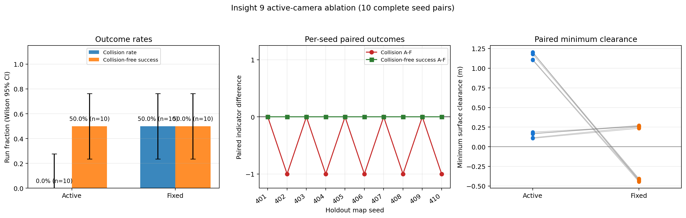
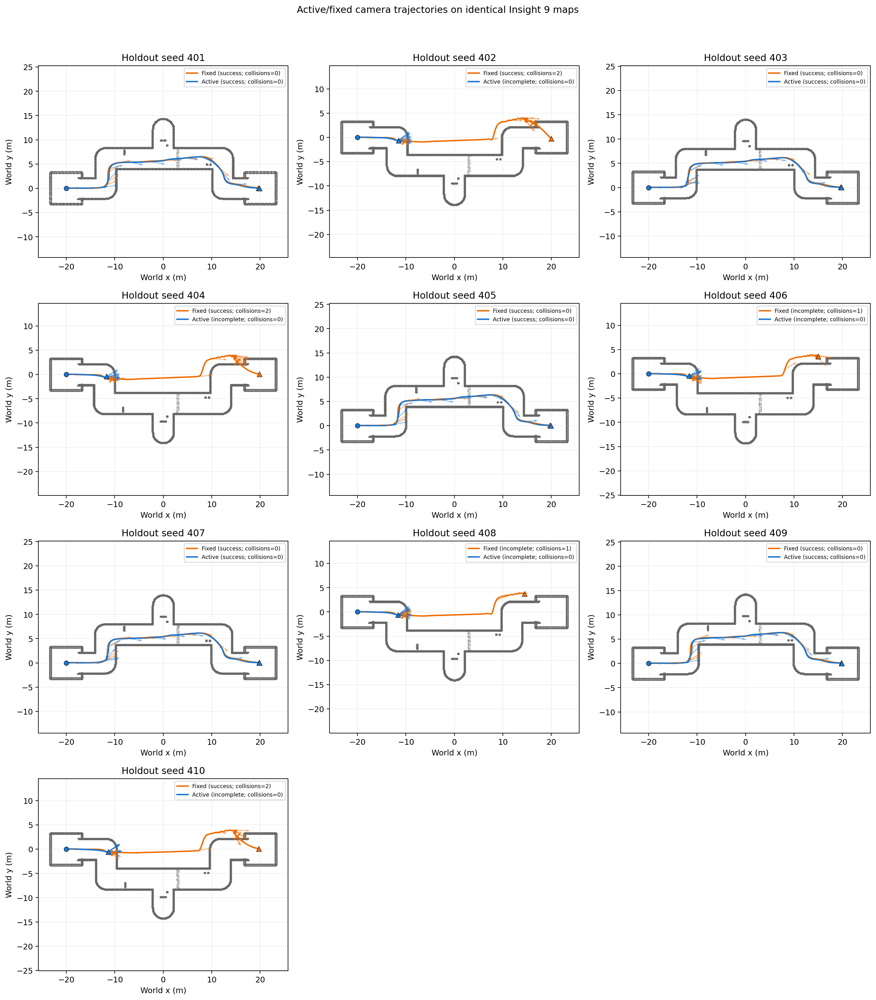
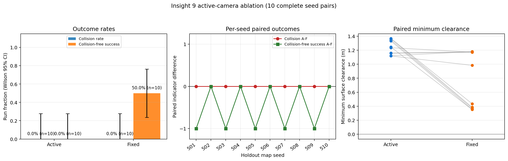
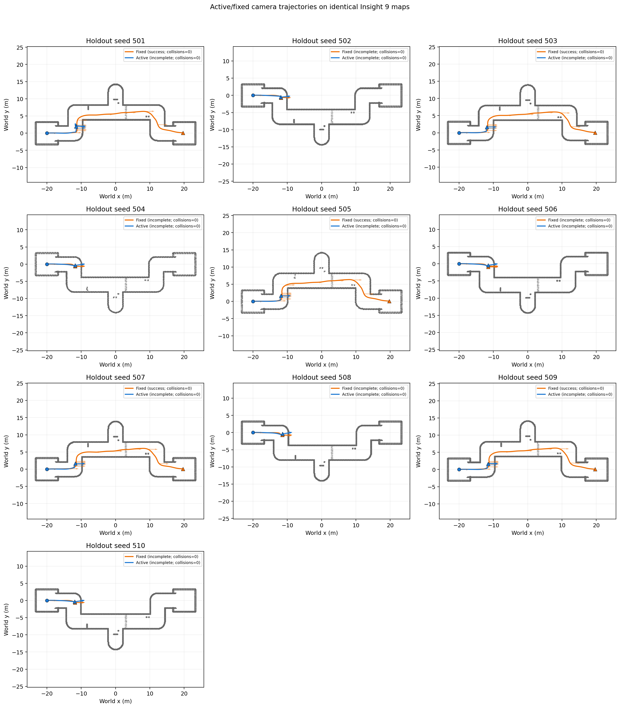

# Insight 9 主动/固定相机 YOPO：100-epoch 严格配对实验

实验目录名中的 `20260820` 是预注册冻结日期（UTC）；训练与全部闭环评测在该预注册
下完成。本文只报告同步修复后的 100-epoch 结果，不包含早期 10-epoch 预览材料。

## 结论先行

这次实验**没有证明主动相机模型整体优于固定相机模型**。

主实验允许机体按原 YOPO 逻辑改变 yaw。在 10 个相同 holdout 地图上，主动组碰撞率
从固定组的 5/10 降到 0/10，平均最小表面净空也更大；但主动组有 5 次停在第一个
盲角附近直至 70 s 超时，导致到达率只有 5/10，低于固定组的 8/10。把安全和任务完成
合并为“无碰撞且到达”后，两组恰好都是 5/10。因此它显示的是更保守的行为，不是已
验证的任务性能提升。

预先声明的固定机体 yaw 诊断更不利于主动组：两组均 0/10 碰撞，但主动组 0/10
到达，固定组 5/10 到达。主动组所有失败都是超时，不是碰撞。综合这两个 stratum，
“允许相机转动会在该场景稳定提高避障任务效果”的假设未获支持。

样本量每组只有 10，Wilson 区间很宽；这里报告描述性差异，不把结果夸大为统计显著或
实机安全证明。

## 1. 预注册设计与严格控制变量

预注册文件为 [`EXPERIMENT_SPEC.json`](EXPERIMENT_SPEC.json)，SHA-256：
`434571b93258224c082dbe7d93a374e9419413c3eaf90f87ddb1b158dbe15c04`。它在 epoch100
checkpoint 和评测产生前冻结，规定了：

- 两臂都是 Insight 9、同一 YOPO 网络、同一 11 维 state 和 12 维输出 head；
- 只改变 `active_camera` treatment、对应的训练图像/相机标签和运行时云台执行；
- 同为 100 epochs、训练 seed 0、batch size 16、4 workers；
- 同一 `maze_type=8`、速度 3 m/s、20 m depth、0.45 m 碰撞半径；
- 每个 evaluation seed 的两臂使用完全相同的 runtime map SHA、点数和 bounds；
- 主 stratum 为 normal body yaw、seeds 401..410；预声明机制诊断为 fixed body yaw、
  seeds 501..510；训练 seeds 3..12 与评测不重叠；
- 顺序按 seed 平衡，避免总是先跑同一 treatment；超时不记为碰撞；所有有效 pair
  都进入统计。

深度帧和 `Vector3Stamped` 相机实际角采用有界一对一近似同步：queue 30、slop 0.03 s、
最低匹配率 0.98。20 个主实验 run 和 20 个诊断 run 均通过相机运动/精确零、深度合同、
同步、地图、checkpoint 与 immutable manifest 绑定检查。

## 2. 数据与训练

两臂都使用 10 张训练地图（seeds 3..12），每张 10,000 个相机位姿。两份数据各有
100,000 张 `160×192` 单通道 uint16 深度图和 800,000 行样本。fixed 生成器消耗与
active 相同的结构随机数，只把四个相机字段精确置零，因此地图、pose、guide 和前 21 个
结构字段严格成对；图像因视角 treatment 不同而理应不同。

[`dataset_pair_audit.json`](dataset_pair_audit.json) 的结论为 `ok=true`，SHA-256：
`2386e2e869679d476f155822dc3994bd0d7d2b9e296e5b5e06e30920da57e4ef`。结构配对 hash 为
`1c40012e40982725c007ef594f58a61d2e1f46718130f6dbda4a7b7013b68b93`；active/fixed
图像集合 hash 分别为 `78240bd8...99b4` 和 `722d20ee...991b`。

两条训练均从 epoch 0 顺序运行到 epoch 100。一个早期终端输出阻塞的 active 进程在
epoch 38 被中止并隔离，正式 active run 随后从 epoch 0 重新训练；其早期 checkpoint
哈希与第一次运行相同。它没有 resume，也没有混入正式评测。项目通用默认仍为 50
epochs；本实验命令显式指定 100。

| 项目 | Active | Fixed |
|---|---:|---:|
| epoch100 checkpoint SHA-256 | `bb59d23a...8439` | `6e970cb6...3afb` |
| immutable training manifest SHA-256 | `e36c28ea...452b` | `dc712f84...d506` |
| 最终 eval total loss | 5.814151 | 5.696447 |
| 最终 eval score loss | 0.141706 | 0.127565 |
| 最终 eval camera loss | 0.007781 | 2.466e-09 |

最终保留的复现模型：

- [`active epoch100`](../../../YOPO/saved/active_camera_chicane_100ep_seed0/epoch100.pth)，
  合同见相邻 `MODEL_CARD.md` 和 `epoch100.manifest.json`；
- [`fixed epoch100`](../../../YOPO/saved/fixed_camera_chicane_100ep_seed0/epoch100.pth)，
  合同见相邻 `MODEL_CARD.md` 和 `epoch100.manifest.json`。

两份 `.pth` 各约 47.5 MB，直接随分支保存。中间 checkpoint、训练数据和 TensorBoard
event 不进入 Git；最终 epoch100、不可变 manifest、resolved config、metrics 和 model card
被精确白名单保留。

## 3. 主实验：normal body yaw

结果来自
[`benchmark_normal_yaw_synced_401_410/summary.json`](benchmark_normal_yaw_synced_401_410/summary.json)，
10 个完整 seed pair、20 个有效 run。严格审计
[`fairness_audit.json`](benchmark_normal_yaw_synced_401_410/fairness_audit.json)
为 `ok=true`，无 error/warning。

| 指标 | Active | Fixed | 配对均值 Active−Fixed |
|---|---:|---:|---:|
| run-level 碰撞 | 0/10 = 0% | 5/10 = 50% | -0.50 |
| 碰撞率 Wilson 95% | [0%, 27.75%] | [23.66%, 76.34%] | — |
| 到达 | 5/10 = 50% | 8/10 = 80% | -0.30 |
| 到达率 Wilson 95% | [23.66%, 76.34%] | [49.02%, 94.33%] | — |
| 无碰撞且到达 | 5/10 = 50% | 5/10 = 50% | 0.00 |
| 平均最小表面净空 | 0.6540 m | -0.0848 m | +0.7389 m |
| 成功 run 平均耗时 | 20.57 s | 33.85 s | — |
| 碰撞进入事件总数 | 0 | 8 | — |

Active 成功的 seeds 为 401、403、405、407、409；其余 5 个均无碰撞超时。Fixed 在
402、404、406、408、410 碰撞，其中 402、404、410 随后仍到达。负净空表示按 0.45 m
UAV 球半径计算发生几何侵入。





每个 run 的完整无人机轨迹、相机状态、碰撞 episode、地图和结果位于
`benchmark_normal_yaw_synced_401_410/runs/seed_XXXXXX_{active,fixed}/`，其中轨迹文件为
`odom_trajectory.csv`。图不是示意图，而是直接从这些 CSV 和每个 pair 的相同地图生成。

## 4. 机制诊断：fixed body yaw

这一 stratum 在评测前已声明，`--fixed-yaw` 同时应用于两臂，用于隔离独立云台相对机体
转向的作用。结果来自
[`benchmark_fixed_body_yaw_synced_501_510/summary.json`](benchmark_fixed_body_yaw_synced_501_510/summary.json)，
同样为 10 个完整 pair、20 个有效 run。其
[`fairness_audit.json`](benchmark_fixed_body_yaw_synced_501_510/fairness_audit.json)
也是 `ok=true`，无 error/warning。

| 指标 | Active | Fixed | 配对均值 Active−Fixed |
|---|---:|---:|---:|
| run-level 碰撞 | 0/10 = 0% | 0/10 = 0% | 0.00 |
| 到达 | 0/10 = 0% | 5/10 = 50% | -0.50 |
| 无碰撞且到达 | 0/10 = 0% | 5/10 = 50% | -0.50 |
| 平均最小表面净空 | 1.2452 m | 0.7587 m | +0.4864 m |
| Fixed 成功 run 平均耗时 | — | 28.67 s | — |

Active 10 次全部无碰撞超时；Fixed 在奇数 seeds 501、503、505、507、509 到达，偶数
seeds 超时。更大的净空来自更早停止，不能单独当作更好的导航。





原始文件位于 `benchmark_fixed_body_yaw_synced_501_510/runs/`，字段与主实验一致。

## 5. 为什么没有得到预期优势

最直接的行为证据是 active 在盲角前保持较大净空后停滞，说明当前学习结果偏保守。
更根本的机制差异是：参考的 `active-perception-RL-navigation` 通过逐帧深度射线累积历史
occupancy，并把 `21×21×21` local grid 输入策略；论文式的优势来自 Active+Grid，而不只是
云台能转。当前 YOPO 仍只消费当前一帧深度和相机角，没有 recurrent memory 或历史局部图；
相机扫开后看到的信息不能在后续帧显式保留。当前 camera target 也是沿 A* guide 的监督
模仿，不是信息增益目标。

所以本次实现证明了开关、配对训练、同步推理和公平评测链路可以工作，也观察到 normal-yaw
下的碰撞描述性下降；但它没有证明主动视觉带来更高的整体避障任务成功率。下一步若继续
研究，应在不改变传感器和地图的前提下加入历史 occupancy/时序表征，再用新的预注册 seeds
比较，不能在看过本结果后只挑有利 seed。

## 6. 分辨率与场景审计

当前代码没有把 Insight 9 原图直接送进网络。仿真和数据生成直接按完整 FoV raycast
`160(W)×192(H)`；实机 bridge 原样发布 SDK Z16，ROS 推理前 nearest resize 到同一尺寸。
相对名义 `544×640`，像素数降至 8.82%（约 11.33 倍），宽高比有约 1.96% 拉伸，不应称为
严格等比例。`YOPO-Simple` 仿真为 `160×90`、网络为 `160×96`，Dataset/ROS 同样 resize；
其源码只有通用 RealSense 和旧 `env: 435`，没有证据可断言它是 D455。

森林 `maze_type=5` 没有删除。新增 `maze_type=8` 是封闭 S 形/T 支路盲角赛道，含落地隔板、
细杆、横梁、封闭 chamber 和顶棚，避免用大量无支撑浮空障碍或从墙顶/墙外绕行。它用于
专门检验主动感知，但本次结果表明“更针对”的地图本身也不能保证主动策略胜出。

## 7. 从零复现

以下命令在仓库根目录、项目 Docker/ROS Noetic 环境中运行。完整 Docker 和编译步骤见
根目录 [`note.md`](../../../note.md)。数据生成会重建目标目录。

### 7.1 生成和审计配对数据

```bash
python3 tools/run_yopo_pipeline.py \
  --mode generate --maze-type 8 --seed 3 --active-camera true \
  --env-num 10 --image-num 10000 \
  --save-path ../dataset_chicane_active_100ep

python3 tools/run_yopo_pipeline.py \
  --mode generate --maze-type 8 --seed 3 --active-camera false \
  --env-num 10 --image-num 10000 \
  --save-path ../dataset_chicane_fixed_100ep

python3 tools/verify_paired_datasets.py \
  dataset_chicane_active_100ep dataset_chicane_fixed_100ep \
  --output-json \
  reports/active_camera_ablation/epoch100_chicane_20260820/dataset_pair_audit.json
```

### 7.2 顺序训练 100 epochs

```bash
python3 tools/run_yopo_pipeline.py \
  --mode train --seed 0 --active-camera true \
  --dataset-path ../dataset_chicane_active_100ep \
  --train-epoch 100 --batch-size 16 --num-workers 4 \
  --run-name active_camera_chicane_100ep_seed0

python3 tools/run_yopo_pipeline.py \
  --mode train --seed 0 --active-camera false \
  --dataset-path ../dataset_chicane_fixed_100ep \
  --train-epoch 100 --batch-size 16 --num-workers 4 \
  --run-name fixed_camera_chicane_100ep_seed0
```

### 7.3 运行主实验与诊断

确保 ROS master 端口空闲。若输出目录已完整存在，复跑时换一个新目录；不要用 `--resume`
覆盖另一份 spec 的产物。

```bash
python3 tools/benchmark_active_camera.py \
  --active-weight YOPO/saved/active_camera_chicane_100ep_seed0/epoch100.pth \
  --fixed-weight YOPO/saved/fixed_camera_chicane_100ep_seed0/epoch100.pth \
  --expected-checkpoint-epoch 100 \
  --seeds 401,402,403,404,405,406,407,408,409,410 \
  --maze-type 8 --map-viz-resolution 0.1 \
  --start=-20,0,2 --end=20,0,2 --velocity 3 \
  --max-depth 20 --collision-radius 0.45 --arrive-dist 1 \
  --segment-timeout 70 --camera-sync-queue-size 30 \
  --camera-sync-slop 0.03 --min-depth-state-match-rate 0.98 \
  --order balanced --order-seed 20260820 \
  --output-dir \
  reports/active_camera_ablation/epoch100_chicane_20260820/benchmark_normal_yaw_synced_401_410

python3 tools/benchmark_active_camera.py \
  --active-weight YOPO/saved/active_camera_chicane_100ep_seed0/epoch100.pth \
  --fixed-weight YOPO/saved/fixed_camera_chicane_100ep_seed0/epoch100.pth \
  --expected-checkpoint-epoch 100 \
  --seeds 501,502,503,504,505,506,507,508,509,510 \
  --maze-type 8 --map-viz-resolution 0.1 \
  --start=-20,0,2 --end=20,0,2 --velocity 3 \
  --max-depth 20 --collision-radius 0.45 --arrive-dist 1 \
  --segment-timeout 70 --camera-sync-queue-size 30 \
  --camera-sync-slop 0.03 --min-depth-state-match-rate 0.98 \
  --order balanced --order-seed 20260820 --fixed-yaw \
  --output-dir \
  reports/active_camera_ablation/epoch100_chicane_20260820/benchmark_fixed_body_yaw_synced_501_510
```

### 7.4 独立严格复验

```bash
python3 tools/verify_ablation_pair.py \
  --manifest reports/active_camera_ablation/epoch100_chicane_20260820/benchmark_normal_yaw_synced_401_410/pair_manifest.json \
  --summary reports/active_camera_ablation/epoch100_chicane_20260820/benchmark_normal_yaw_synced_401_410/summary.json \
  --active-training-manifest YOPO/saved/active_camera_chicane_100ep_seed0/epoch100.training_manifest.json \
  --fixed-training-manifest YOPO/saved/fixed_camera_chicane_100ep_seed0/epoch100.training_manifest.json \
  --training-seeds 3,4,5,6,7,8,9,10,11,12 \
  --expected-training-epochs 100

python3 tools/verify_ablation_pair.py \
  --manifest reports/active_camera_ablation/epoch100_chicane_20260820/benchmark_fixed_body_yaw_synced_501_510/pair_manifest.json \
  --summary reports/active_camera_ablation/epoch100_chicane_20260820/benchmark_fixed_body_yaw_synced_501_510/summary.json \
  --active-training-manifest YOPO/saved/active_camera_chicane_100ep_seed0/epoch100.training_manifest.json \
  --fixed-training-manifest YOPO/saved/fixed_camera_chicane_100ep_seed0/epoch100.training_manifest.json \
  --training-seeds 3,4,5,6,7,8,9,10,11,12 \
  --expected-training-epochs 100
```

验收时不要加 `--allow-incomplete` 或 `--skip-weight-check`。若重新生成图，可对对应
`summary.json` 运行 `tools/plot_active_camera_ablation.py`；原图和原始 CSV 已随本报告保留。

## 8. 适用边界

- 每 arm 每 stratum 只有 10 个地图，无法给出窄置信区间。
- 结果只覆盖当前 simulator、maze 8、3 m/s、该组模型和 seeds；不能外推为实机结论。
- real bridge 仍需 CameraInfo、畸变/rectification、深度单位、云台/相机硬件时间同步和安全
  控制验证。
- 当前网络无历史 occupancy 和记忆，是主动感知机制最重要的缺口。
- 训练使用可复现 seed 和确定性 warn-only 设置，但部分 CUDA backward 没有 bitwise
  deterministic 实现；重新训练应按 manifest 比较合同，不承诺 `.pth` 逐 bit 相同。

因此最终结论是：**100-epoch 主动相机模型在 normal-yaw 组表现出更少碰撞和更大净空，
但没有提高无碰撞到达率；在固定机体 yaw 诊断中反而降低了到达率。当前证据不支持宣称
主动感知 pipeline 优于固定相机基线。**
